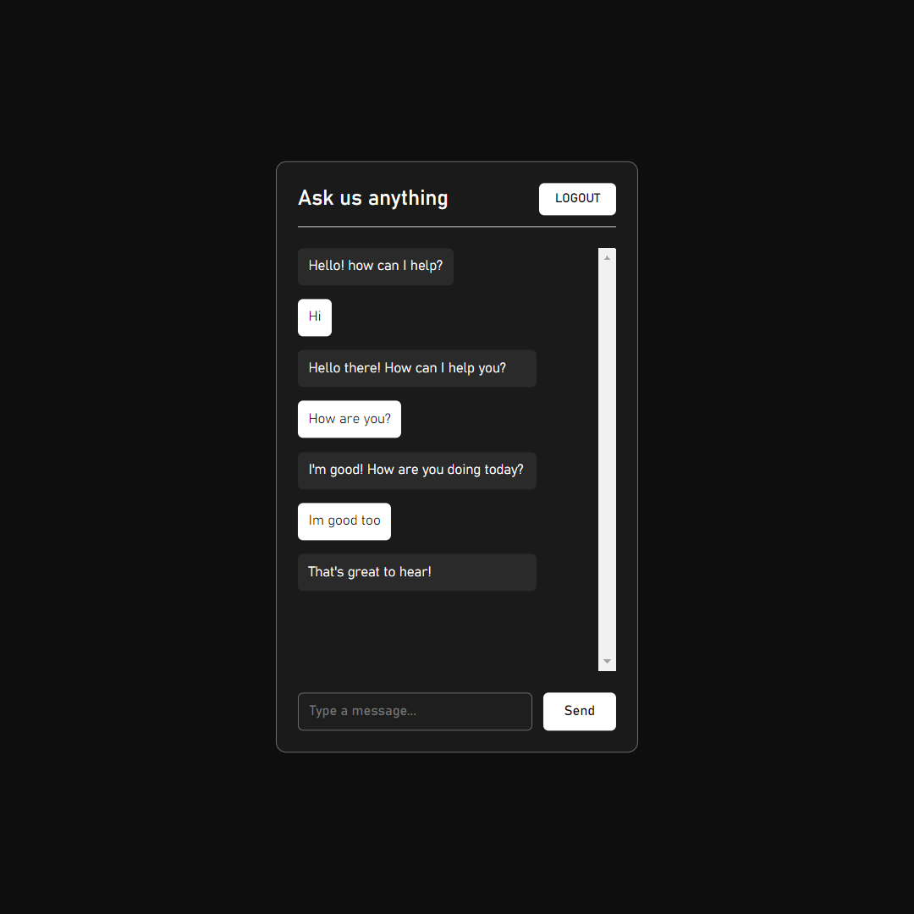

# Basic-chat-ui

<h2>About</h2>
A very basic web application with a chat based UI, written in JavaScript and designed with HTML and CSS in a minimalistic design.

<h2>Note</h2>
Login.html is the index file

<h2>Screenshots</h2>

